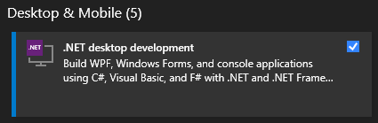
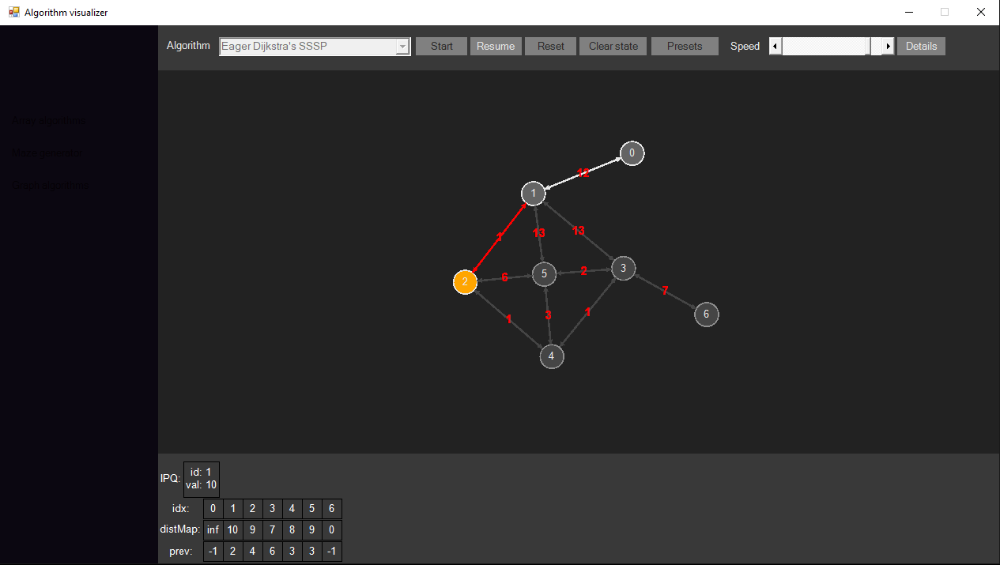
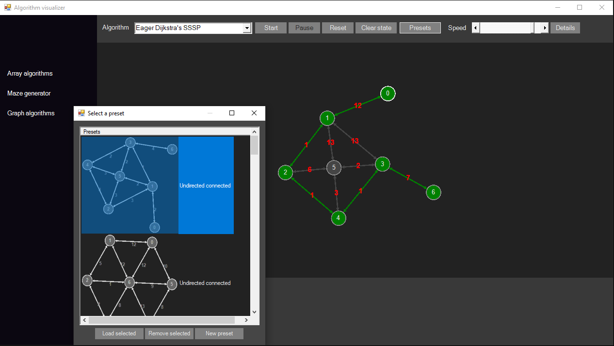
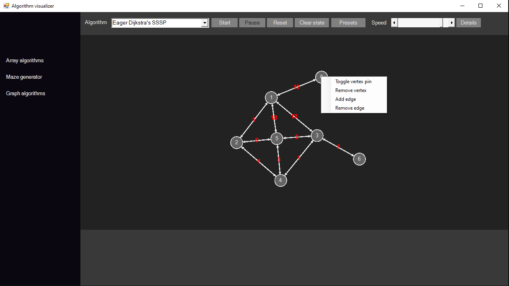
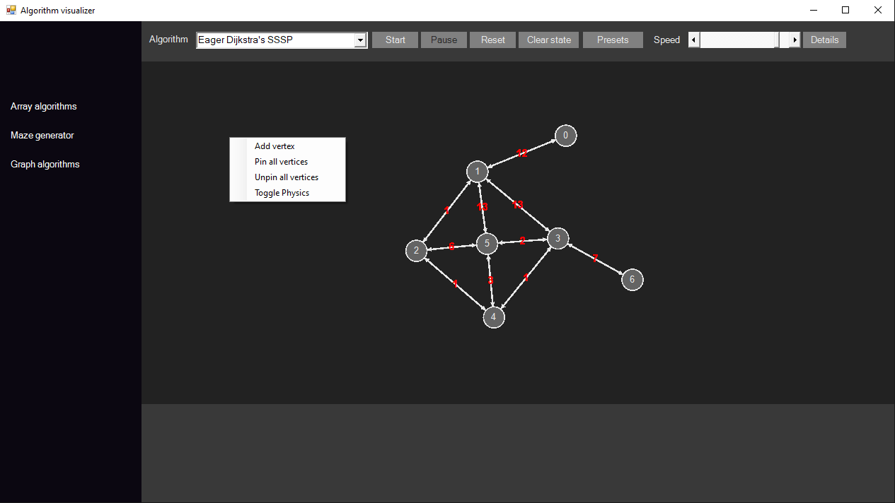
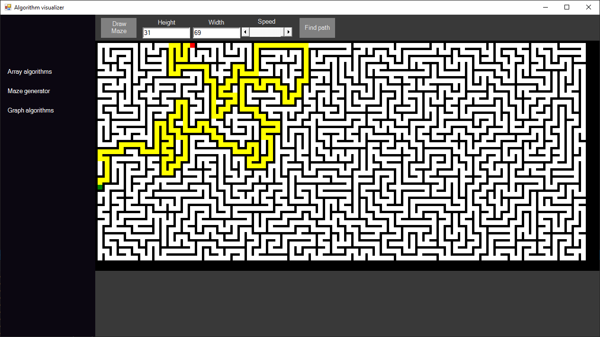
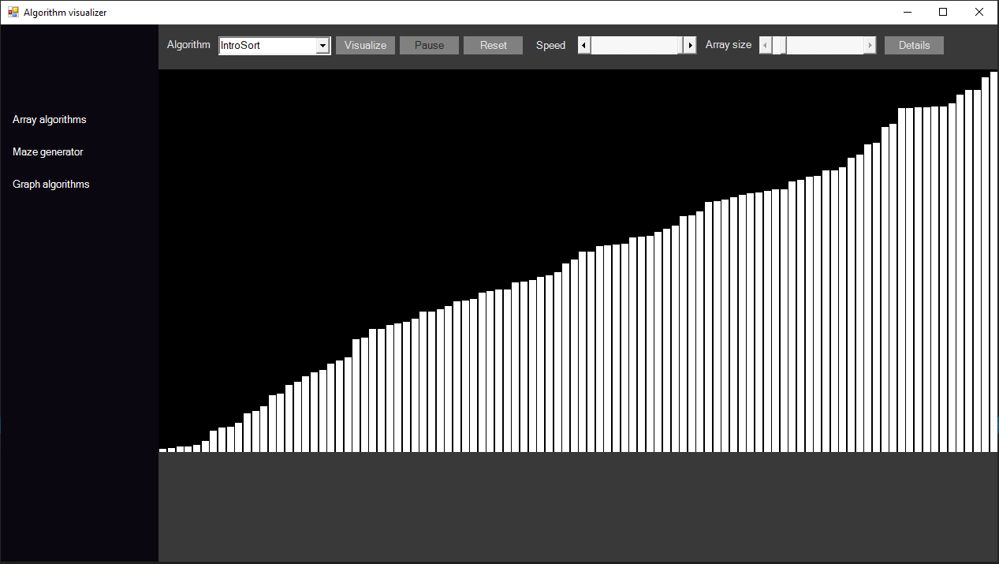

# Algorithm visualizer

A C# winform app containing a collection of algorithms visualized.

### Sorting:
Insertion, Selection, Bubble, Merge, Quick, Heap, Counting, Radix, Introspective.
### Searching:
Binary, Ternary, Exponential.
### Trees (visuals not yet supported):
Binary tree and BST, Depth/Breadth first traversals, Construction using given traversals(pre/post/level + in).
### Graph theory:
BFS, DFS, Connected components using DFS or a disjoint set, Prim's and Kruskal's MST, DFS based maze generator, Top sort DFS, Kahn's top sort, SSSP for DAG, Dijkstra's SSSP, Kosaraju's and Tarjan's strongly connected components, Bellman Ford's SSSP.

# Setup (Microsoft Visual Studio)

- Clone the repository.
- Install Microsoft Visual Studio and include .NET Framework in the installer:

- Open the project, for example: run AlgorithmVisualizer.sln using Microsoft Visual Studio.
- Run.

# Screens

# License

This content is released under the [MIT license](https://opensource.org/licenses/MIT).
